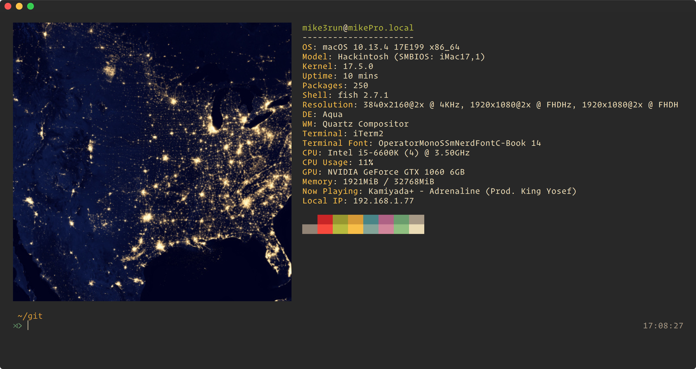

# Shelldandy's Dotfiles :computer:



My current terminal setup

Check more images in the images folder :nail_care:

## Works best with...
In my current setup I'm using some themes and plugins to make the whole experience more enjoyable without adding weight to the startup.

- iTerm configuration files for extra swag

- Introducing Neovim support and swag

- Uses vim-plug for plugin management on neovim

- [Node version manager](https://github.com/creationix/nvm)

## Installing Everything from Scratch

- First log into your AppStore and download X-Code we will need this for git and other maybe important tools.
- Now git clone the repo

```sh
$ git clone https://github.com/mike3run/dotfiles.git
```

- Now cd into `scripts`

```sh
$ chmod +x install.sh
$ ./install.sh
# If you want my AppStore downloads
# They only work if you had downloaded them too before
$ ./install.sh --mas-install
```

- Sit back and enjoy
- Note: `mas.sh` script will only work if you have also purchased those apps so you might want to edit that part or delete it totally
- I'm talking about all the commands that start with `mas install XXXXX`

- Now cd outside of the dotfiles folder and run

```sh
$ rcup -d dotfiles -v
```

- That will sync the actual dotfiles in your system and you can git pull for life and be in sync.

- Enjoy

- Remember to pull from time to time and in neovim run `:PlugUpdate`

💕💕💕
