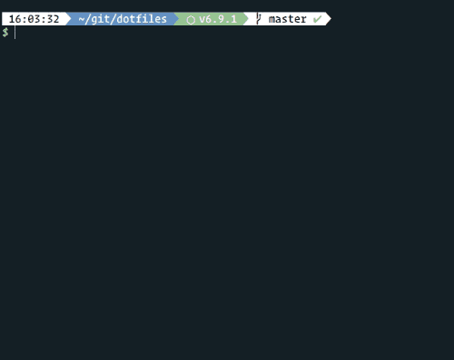

# My dotfiles
I first started using thoughtbots dotfiles but im not really that much of a power user of all the dot things so here's my take on dotfiles with stuff i actually use on a day to day basis.

## Awesome perks
I have setup my vim to change the color scheme and writing mode to use pencil here's a small gif that explains how that works... much wow!

## Works best with...
In my current setup I'm using some themes and plugins to make the whole experience more enjoyable without adding weight to the startup.

- Introducing Neovim support and swag

- Uses vim-plug for plugin management on neovim

- Also remember to enable true colors on your terminal and italics support to use with the OceanicNext theme and Operator Mono font. [Read More](https://bruinsslot.jp/post/how-to-enable-true-color-for-neovim-tmux-and-gnome-terminal/)

- reattach-to-user-namespace install with brew install reattach-to-user-namespace this is to make copy and paste great again on mac

- [Oh-my-zsh](https://github.com/robbyrussell/oh-my-zsh)

- [Bullet train zsh theme](https://github.com/caiogondim/bullet-train-oh-my-zsh-theme) with [maglev tmux theme](https://github.com/caiogondim/maglev)
- [Tmuxinator](https://github.com/tmuxinator/tmuxinator)

- [Node version manager](https://github.com/creationix/nvm)

- [Tmux Plugin Manager](https://github.com/tmux-plugins/tpm)

## To-Do

- Small shell file to auto install/copy everything...
